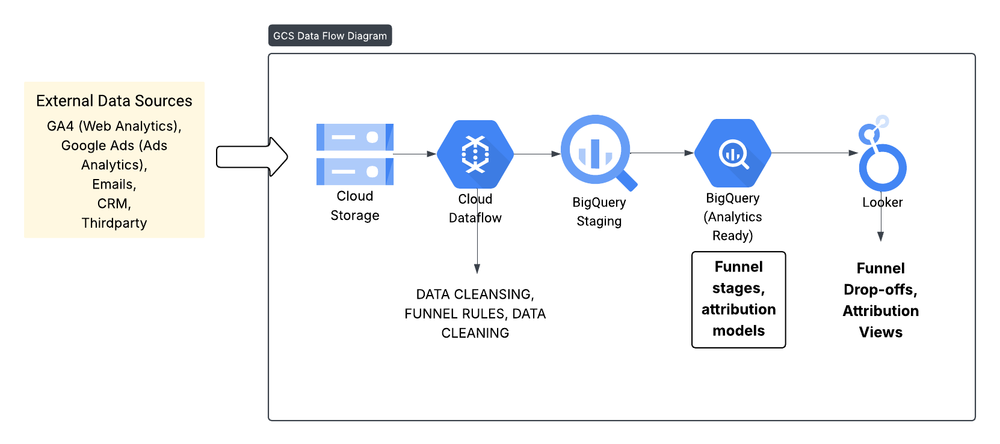
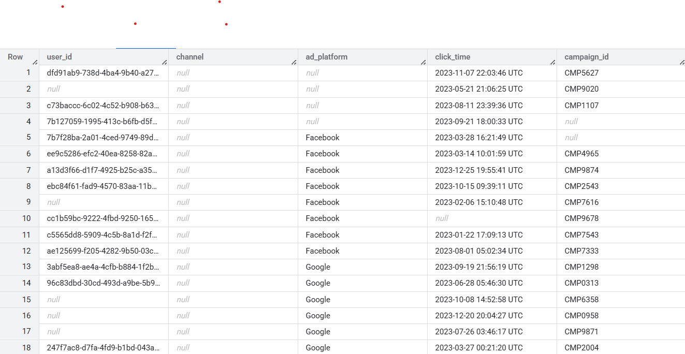
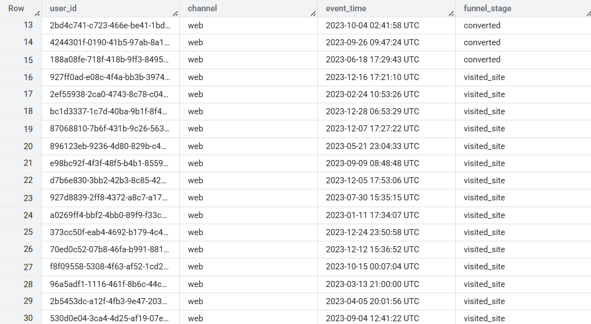
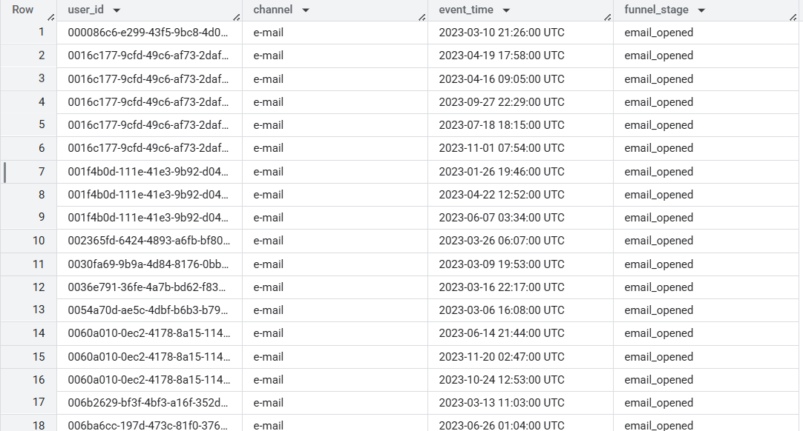
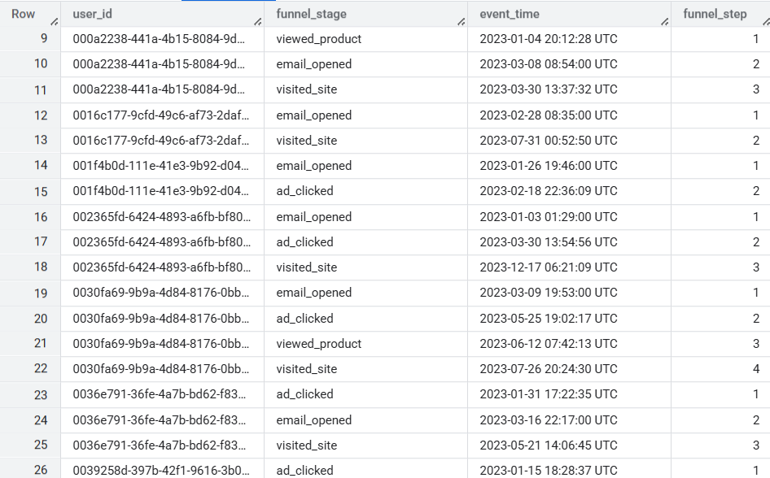
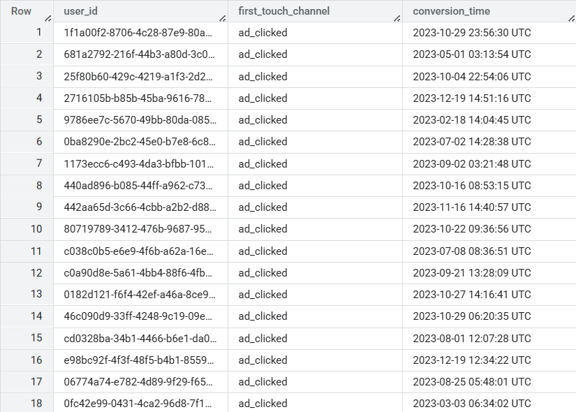
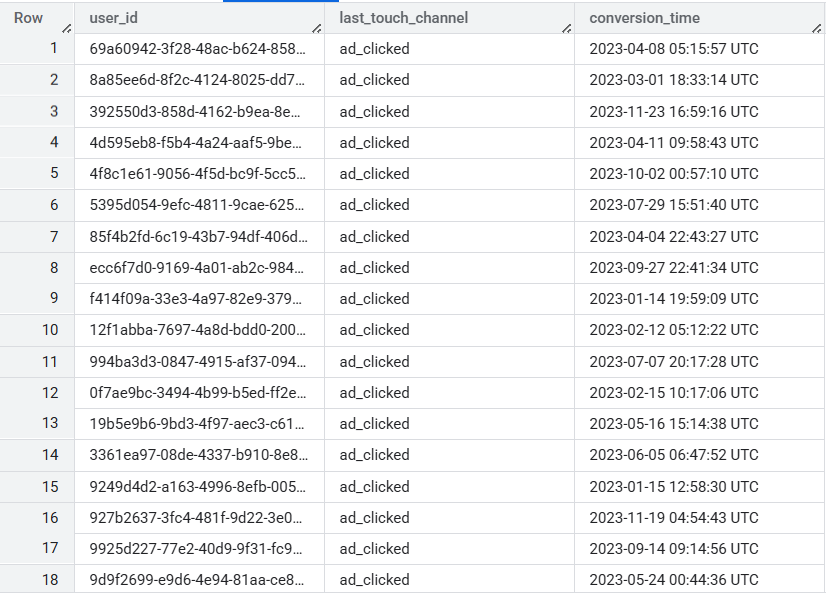
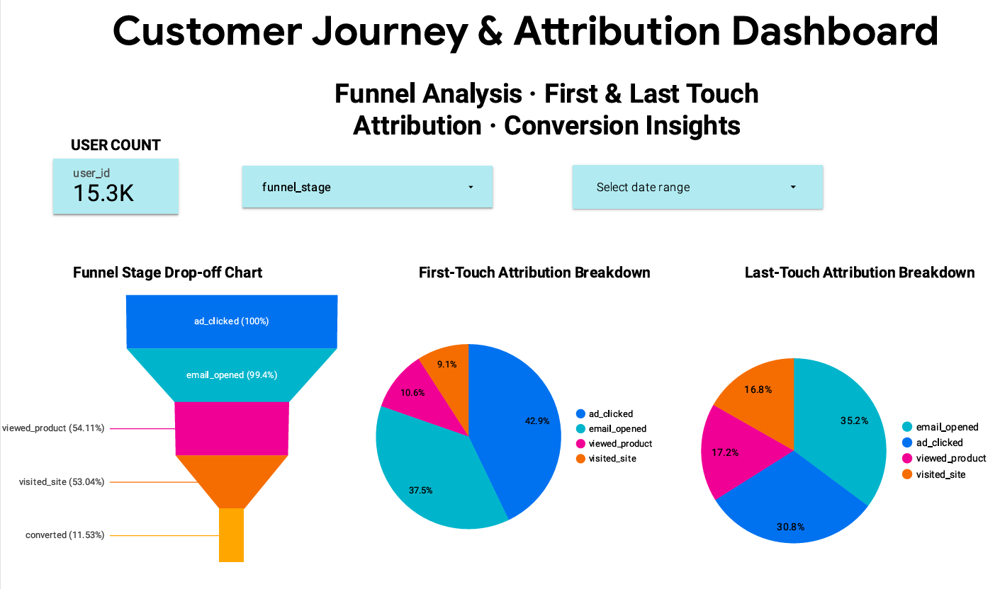
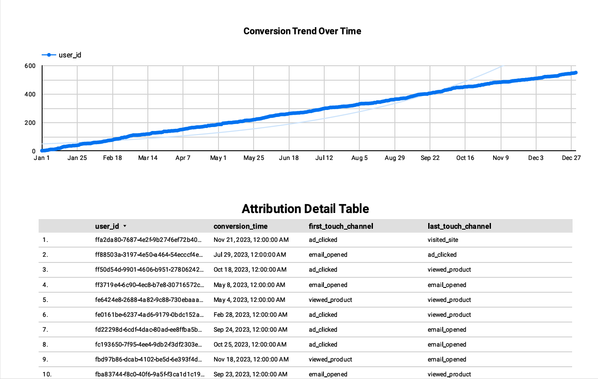

# Customer Journey Attribution Pipeline

A full-stack, professional-grade data pipeline built in Google Cloud Platform (GCP) for analyzing customer journeys, marketing funnel behavior, and attribution modeling across touchpoints like ads, email, and website sessions.

## Objective
To simulate a real-world multi-touch marketing attribution pipeline that:

- Cleans and validates raw engagement data

- Constructs ordered customer journeys across channels

- Calculates attribution models (first-touch, last-touch)

- Visualizes business insights in Looker Studio

- Automates ingestion, transformation, and monitoring

## Architecture

- Key GCP Services Used:

- Cloud Storage

- BigQuery

- Dataform (for transformation + assertions)

- Cloud Functions + Cloud Scheduler (automation)

- Looker Studio (dashboarding)

- Cloud Logging (monitoring)

## End-to-End Pipeline Breakdown
### 1. Data Ingestion
Files uploaded to Cloud Storage, then loaded to BigQuery Staging.
1. Staging Tables:
2. ads_raw
3. web_traffic_raw

### 2. Transformation & Funnel Construction

Clean Tables Created
- ads_clean
- web_clean
- email_clean

Unified into:
- customer_journey_flat

- user_funnel_journey - stepwise ordered funnel per user

Note: SQL code for this transformation is in transformation folder. 

#### Ads Data Cleaned Sample
 
#### Web Data Cleaned Sample

 
#### Email Logs Data Cleaned Sample

#### User Funnel Journey Sample

### 3. Data Quality Checks (Assertions)

Using Dataform assertions for:

- Completeness (NULL checks on user_id and event_time)

- Validity (channel tag correctness)

- Uniqueness (duplicate funnel events)

Note: Find SQLX code in Dataform folder

### Attribution Modeling
First-Touch Attribution
- Credits first event before conversion.

Last-Touch Attribution
- Credits last event before conversion.

Tables:

#### First Touch Attribution Sample

#### Last Touch Attribution Sample

### Dashboarding in Looker Studio

[Dashboard Link](https://lookerstudio.google.com/s/vkVWQF_irzw)

Includes:

- KPI scorecards (conversions, conversion rate)

- Funnel visualization

- Attribution breakdown (first-touch vs. last-touch)

- Interactive filters (channel, date range, model selector)

- Conversion timeline trends

### Automation
Scheduled Daily Refresh
Cloud Scheduler triggers

Cloud Function executes Dataform and BigQuery logic

## Use Cases
This pipeline simulates how companies:

- Analyze campaign ROI across channels

- Optimize conversion funnels

- Attribute revenue to specific marketing touchpoints

- Identify drop-off patterns

- Enable data-driven budget allocation

